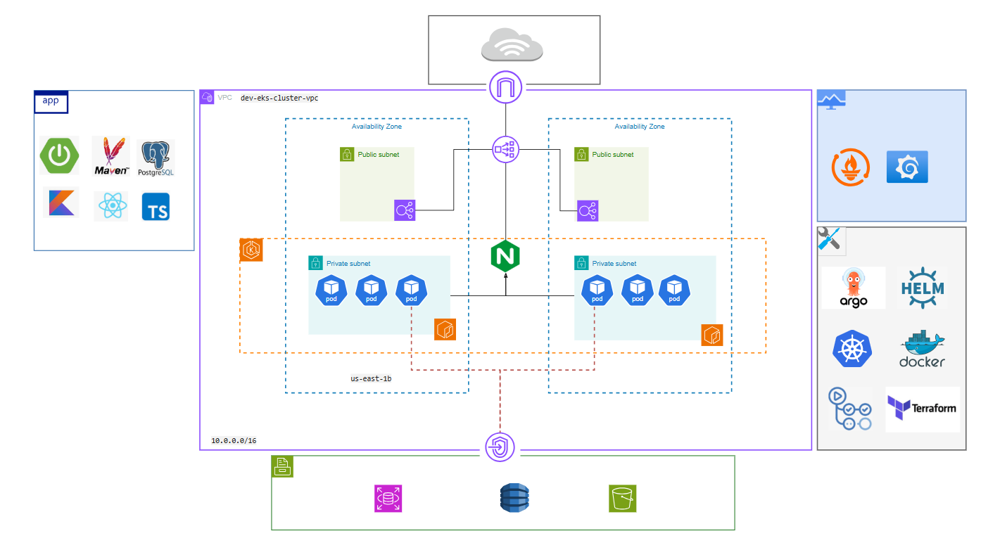
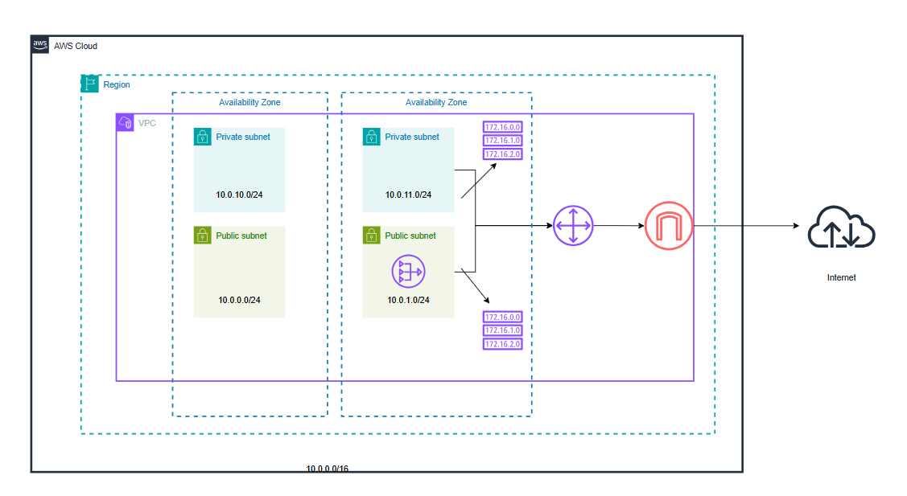
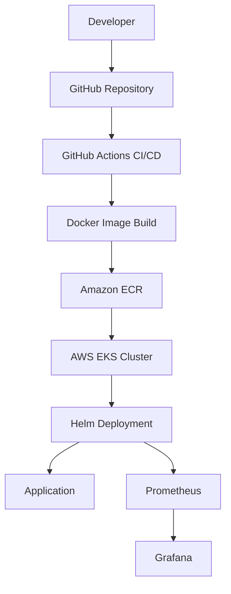

# Bookstore Project


This project is a cloud-native bookstore application deployed on AWS using Terraform, Kubernetes, Helm, Docker, and GitHub Actions.

## Architecture



This project implements a cloud-native architecture on AWS with the following layers:

- Terraform provisions the AWS infrastructure, including VPC, EKS, IAM, ECR, Security Groups, and RDS.
- Docker Compose is used for local development and testing.
- Kubernetes deploys the backend and frontend using Helm charts.
- GitHub Actions automates CI/CD.
- Prometheus and Grafana provide monitoring.

### VPC Architecture



## Infrastructure

The infrastructure is managed with Terraform and includes:

- VPC
- EKS Cluster
- Node Groups
- IAM Roles
- Security Groups
- Amazon ECR
- RDS Database

## Quick Start

### 1. Run locally with Docker Compose

Start the backend:

```bash
cd BackBs/bookstore
docker compose up --build
```

Start the frontend:

```bash
cd FrontBs/bookstore
docker compose up --build
```

Access the services:

- Frontend: http://localhost:3000
- Backend: http://localhost:8081

### 2. Deploy to Kubernetes with Helm

Create the namespace:

```bash
kubectl create namespace bookstore
```

Deploy the chart:

```bash
helm dependency update ./Infrastructure/K8s/helm/bookstore
helm upgrade --install bookstore ./Infrastructure/K8s/helm/bookstore \
  --namespace bookstore \
  --create-namespace \
  --wait \
  --timeout 5m
```

Check the services:

```bash
kubectl get svc -n bookstore
```

Port-forward locally:

```bash
kubectl port-forward -n bookstore svc/<frontend-service-name> 3000:80
kubectl port-forward -n bookstore svc/<backend-service-name> 8081:8081

kubectl describe pod <pod-name> -n bookstore
kubectl logs <pod-name> -n bookstore

kubectl port-forward -n bookstore svc/bookstore-backend 8081:8081
kubectl scale deployment bookstore-backend --replicas=0 -n bookstore

kubectl create namespace argocd
kubectl apply -n argocd -f https://raw.githubusercontent.com/argoproj/argo-cd/stable/manifests/install.yaml
kubectl replace -n argocd -f https://raw.githubusercontent.com/argoproj/argo-cd/stable/manifests/install.yaml --force

kubectl port-forward svc/argocd-server -n argocd 8080:443
kubectl -n argocd get secret argocd-initial-admin-secret -o jsonpath="{.data.password}" | base64 -d ; echo

Login:
```

### 3. Provision infrastructure with Terraform

Provision the first part of the infrastructure:

```bash
cd Infrastructure/Terraform-part-1
terraform init
terraform apply -var-file=terraform.tfvars
```

Provision the second part (provisions EKS, ingress-nginx, and the monitoring stack via Helm releases):

```bash
cd Infrastructure/Terraform-part-2
terraform init
terraform apply -var-file=dev.tfvars

terraform init -upgrade
terraform providers
terraform validate
```

### 4. Access monitoring tools

Port-forward Prometheus and Grafana:

```bash
kubectl port-forward -n monitoring svc/prometheus-kube-prometheus-prometheus 9090:9090
kubectl port-forward -n monitoring svc/prometheus-grafana 3001:80
kubectl port-forward -n monitoring svc/prometheus-kube-prometheus-alertmanager 9093:9093

```

Then open:

- Prometheus: http://localhost:9090
- Grafana: http://localhost:3001

## CI/CD Pipeline

GitHub Actions automates:

1. Code checkout and testing
2. Docker image build
3. Push image to Amazon ECR
4. Deploy application to EKS using Helm

## Monitoring

Monitoring is implemented using:

- Prometheus
- Grafana

Metrics include:

- Application metrics
- CPU and memory usage
- Kubernetes pod status


